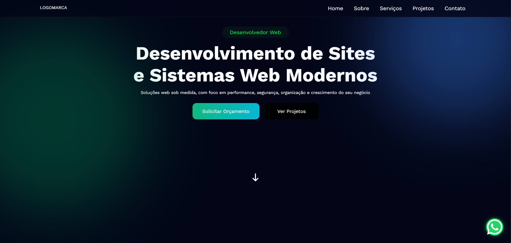
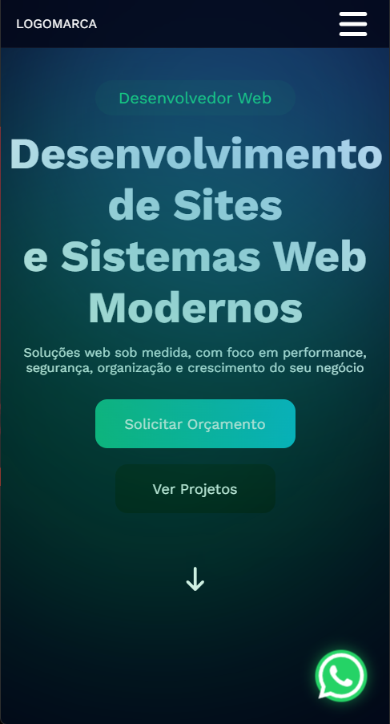

# 🚀 Portfólio Profissional - Pedro Henrique


Nova versão do meu portfólio desenvolvida com foco em arquitetura escalável, performance e experiência do usuário.

---

## 🌐 Deploy

🔗 **Versão atual:**  
👉 https://portifolio-v2-pied.vercel.app/

🔗 **Versão anterior (v1):**  
👉   https://devpedrohenrique25.github.io/Portifolio/

---

## 🎥 Preview

### Desktop


### Mobile



---

## 📌 Sobre o Projeto

Este projeto foi desenvolvido como uma **SPA (Single Page Application)** utilizando React.

A nova versão representa uma evolução arquitetural em relação à primeira versão, com melhorias em:

- Organização estrutural
- Componentização
- Performance
- Experiência do usuário
- Clareza na proposta de valor

O objetivo foi criar um portfólio moderno, responsivo e estratégico, focado tanto em oportunidades profissionais quanto em conversão de clientes.

---

## 🏗 Arquitetura e Organização

A aplicação foi estruturada utilizando uma abordagem modular baseada em componentes reutilizáveis.

### Principais melhorias:

- Separação clara entre layout, componentes e páginas
- Componentização estratégica
- Organização escalável de pastas
- Redução de código repetido
- Estrutura preparada para expansão futura

---

## ⚡ Performance e Otimização

- Estrutura SPA otimizada
- Código limpo e padronizado
- Organização eficiente de imports
- HTML semântico
- Melhor hierarquia visual
- Animações com AOS aplicadas de forma estratégica

---

## 📱 Experiência do Usuário

- Layout totalmente responsivo
- Menu mobile animado com controle de estado (`useState`)
- Scroll programático entre seções
- Animações suaves com AOS
- Interface moderna e minimalista
- Foco em clareza e conversão

---

## 🛠 Tecnologias Utilizadas

- React.js
- JavaScript (ES6+)
- CSS3
- AOS (Animate On Scroll)
- React Hooks (useState, useEffect)
- Vite

---

## ▶️ Como Rodar o Projeto Localmente

### 1️⃣ Clone o repositório

```bash
git clone https://github.com/seu-usuario/seu-repositorio.git

2️⃣ Acesse a pasta do projeto
cd seu-repositorio

3️⃣ Instale as dependências
npm install

4️⃣ Execute o projeto
npm run dev


O projeto estará disponível em:

http://localhost:5173

📈 Evolução

A primeira versão do portfólio foi mantida como referência da minha evolução técnica.

Esta nova versão demonstra melhorias em:

Arquitetura

Organização de código

Escalabilidade

Performance

Experiência do usuário

Meu objetivo é evoluir constantemente a qualidade técnica dos projetos que desenvolvo.

👨‍💻 Autor

Pedro Henrique
Desenvolvedor Web

🔗 LinkedIn: https://www.linkedin.com/in/pedro-henrique-39148b2a1/

🔗 GitHub: https://github.com/DevPedroHenrique25
